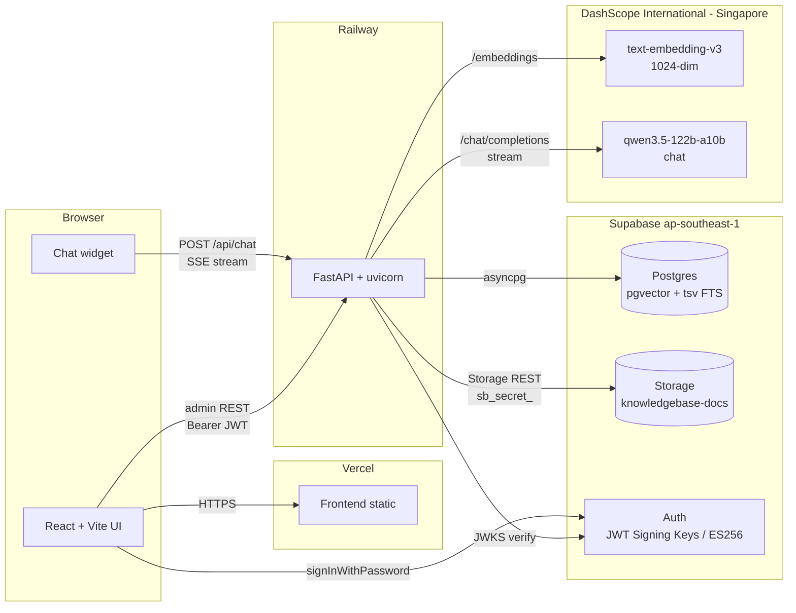

# System design — RAG knowledgebase chatbot

A grounded chatbot for marketing landing pages. Anonymous public visitors ask questions; the assistant answers only from a corpus that an admin curates through `/admin/knowledge`. Retrieval is hybrid (pgvector cosine + Postgres FTS, fused via Reciprocal Rank Fusion); generation streams from Qwen via DashScope International over SSE.

This folder explains the architecture in enough detail to debug a slow chat, diagnose a stuck ingestion, or onboard a new contributor without reading every file. Read [`chat-pipeline.md`](chat-pipeline.md) for the end-to-end request walk and the latency / bottleneck analysis. Read [`ingestion-pipeline.md`](ingestion-pipeline.md) for the upload-to-ingested lifecycle.

## High-level architecture

## Components

| Component | Where it lives | Role |
|---|---|---|
| Frontend | `repos/react-vite-frontend/`, deployed to Vercel | Landing page + chat widget + admin CMS + knowledge upload UI |
| Backend | `repos/fast-api-backend/`, deployed to Railway (`railpack.json`) | Chat SSE endpoint, document CRUD, ingestion pipeline, landing-config CRUD |
| Supabase Postgres | `aws-0-ap-southeast-1.pooler.supabase.com:5432` | Documents, chunks (with `Vector(1024)` + GENERATED `tsv`), chat sessions/messages, landing config |
| Supabase Storage | private bucket `knowledgebase-docs` (currently toggled public for clickable source links) | Original uploaded documents |
| Supabase Auth | ECC P-256 JWT signing keys (ES256) | Admin login only; chat is anonymous |
| DashScope International | `https://dashscope-intl.aliyuncs.com/compatible-mode/v1` | `text-embedding-v3` for query/chunk embeddings; `qwen3.5-122b-a10b` for chat generation |

## Environment matrix

| Variable | Lives on | Purpose |
|---|---|---|
| `VITE_API_URL` | Vercel | Backend base URL the FE calls |
| `VITE_SUPABASE_URL` / `VITE_SUPABASE_PUBLISHABLE_KEY` | Vercel | Supabase JS client for admin login |
| `CORS_ORIGINS` | Railway | Comma-separated FE origins allowed to call BE |
| `DASHSCOPE_API_KEY` / `DASHSCOPE_BASE_URL` | Railway | Qwen LLM + embeddings client config |
| `QWEN_CHAT_MODEL` / `QWEN_EMBEDDING_MODEL` / `QWEN_MAX_INPUT_TOKENS` | Railway | Model selection and context window cap |
| `SUPABASE_URL` / `SUPABASE_SECRET_KEY` | Railway | `supabase-py` admin client (Storage + Auth admin ops) |
| `SUPABASE_JWT_SECRET` | Railway (optional) | Legacy HS256 fallback. New projects use JWKS at `{SUPABASE_URL}/auth/v1/.well-known/jwks.json` — leave empty. |
| `DATABASE_URL` | Railway | Direct asyncpg connection for pgvector + FTS queries (the supabase-py client can't do those) |
| `SUPABASE_STORAGE_BUCKET` | Railway | Private bucket name for document uploads |

## Data model snapshot

- `documents` — file metadata, `status enum (uploaded, ingesting, ingested, failed)`, `chunk_count`, `error_message`.
- `chunks` — `content`, `embedding Vector(1024)`, and `tsv tsvector` GENERATED ALWAYS AS `to_tsvector('english', content)` STORED. Indexes: ivfflat on `embedding` (cosine ops, 100 lists) + GIN on `tsv`.
- `chat_sessions`, `chat_messages` — full transcript persistence, including `sources JSONB` per assistant turn so we can render source chips on history reload.
- `landing_config` — single-row JSONB blob backing the marketing landing page CMS. The blob also stores `chat_mode` (`"public"` | `"internal"`); the chat endpoint reads this on every request and gates anonymous callers when it is `"internal"`.

## Roles and authorization

Three roles live in Supabase Auth's `user_metadata.role`: `super_admin` > `admin` > `user`.

- The backend verifies every JWT against Supabase's JWKS (ES256) and reads `user_metadata.role` from the verified claims (`app/core/auth.py`).
- `require_role(*roles)` is the single authorization dependency every protected endpoint uses; higher roles transitively pass lower-role checks (privilege hierarchy expansion).
- `get_current_user_optional` returns `AuthUser | None` for endpoints that legitimately accept anonymous callers — the chat endpoint uses it so it can refuse anonymous callers only when `landing_config.chat_mode == "internal"`.

Surface-level matrix:

| Surface | Anonymous | user | admin | super_admin |
|---|---|---|---|---|
| Public landing page | ✓ | ✓ | ✓ | ✓ |
| Chat widget (public mode) | ✓ | ✓ | ✓ | ✓ |
| Chat widget (internal mode) | 401 → sign-in gate | ✓ | ✓ | ✓ |
| `/workspace` (read-only KB + wider chat) |  | ✓ | ✓ | ✓ |
| `GET /api/documents` |  | ✓ | ✓ | ✓ |
| `/admin/knowledge` + upload / ingest / delete / rename |  |  | ✓ | ✓ |
| `/admin/users` + Users CRUD |  |  | ✓ | ✓ |
| `/admin/cms` + landing CMS save + chat-mode toggle |  |  |  | ✓ |

A signed-in user with a missing or unknown role is treated as misconfigured — the backend returns 403 and the FE `RoleGuard` signs them out with `/login?error=missing_role`.

## Where to read next

- **[rag-overview.md](rag-overview.md)** — high-level RAG mental model: one diagram covering write side (upload → embed → vector table) and read side (query → hybrid retrieval → Qwen). Answers FAQs about text-only embeddings, RRF vs BM25, query rewriting, etc.
- **[chat-pipeline.md](chat-pipeline.md)** — the chat request lifecycle, file/line walkthrough, and the latency budget. Start here if the chat feels slow.
- **[ingestion-pipeline.md](ingestion-pipeline.md)** — upload → parse → embed → chunk insert. Start here if a document is stuck on `ingesting` or comes back `failed`.
