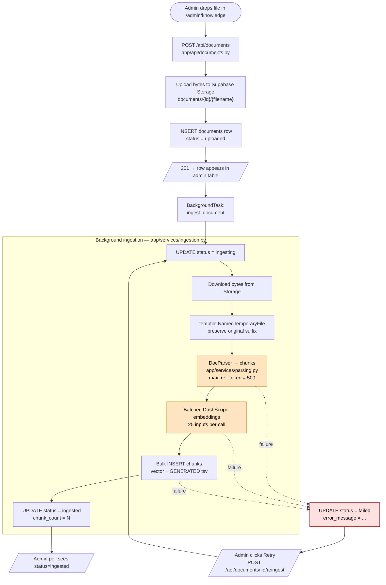

# Ingestion pipeline — upload to ingested

This document covers the admin-facing flow: how a PDF/DOCX/etc. becomes searchable chunks in Postgres. Useful when a document is stuck on `ingesting`, comes back `failed`, or returns no chunks.

## High-level flow



Orange = slow steps (parse, embed) — most of the ingestion wall-clock lives here. Red = the failure path; any exception in parse/embed/insert lands on the row with a human-readable `error_message` the admin sees on Retry.


## Step-by-step walk

1. **Upload received** — `app/api/documents.py:41` (`async def upload_document`). FastAPI buffers the multipart body, then we read bytes once into memory (acceptable: 50 MB cap enforced by the FE Dropzone).
2. **Storage upload** — `storage.upload_bytes(path, content, content_type)` calls `supabase.storage.from_(bucket).upload(path, content, options)`. Path scheme `documents/{document_id}/{filename}`. If the bucket does not exist this raises `StorageApiError("Bucket not found")` and the endpoint returns `500 STORAGE_UPLOAD_FAILED`.
3. **`documents` row insert** — happens *after* a successful Storage upload, so there is never an orphan row pointing at a missing object. Status starts as `uploaded`.
4. **BackgroundTask kicked off** — `documents.py:74` adds `ingest_document(doc.id)` to the request's `BackgroundTasks`. FastAPI runs it after the response has been returned, in the same process.
5. **`ingest_document(document_id)`** — entry point at `app/services/ingestion.py:21`. Each DB interaction uses its own short-lived `_sessionmaker()` session (the same pattern as `chat.py`, for the same reason: not bound to a request lifetime).
6. **Status → `ingesting`** — `ingestion.py:32`. The FE polling loop notices and renders the in-progress spinner.
7. **Download from Storage** — `ingestion.py:40` (`storage.download_bytes(doc.storage_path)`) → bytes back into the worker process.
8. **Write to a temp file** — `ingestion.py:42–44`. DocParser wants a file path, not bytes. We preserve the original suffix (`.pdf`, `.docx`, ...) because DocParser dispatches on it.
9. **Parse to chunks** — `app/services/parsing.py:23` (`parse_to_chunks(local_path)`). We construct `DocParser({"max_ref_token": 500})` and call it. DocParser internally:
   - reads the file with the right backend (`pdfplumber` / `pypdf` / `python-docx` / etc.),
   - caches the parsed-and-chunked JSON to `workspace/tools/doc_parser/<sha256-of-content>_500` (relative to CWD; gitignored),
   - returns `{url, title, raw: [{content, metadata, token}, ...]}`.

   Our wrapper flattens `raw[*].content`, drops empties, returns `list[str]`.
10. **Zero-chunks guard** — `ingestion.py:47–48`. If `parse_to_chunks` returns `[]`, we raise `RuntimeError("DocParser produced zero chunks")` and the row goes to `failed`. Common causes: image-only PDF (no text layer), unrecognized binary, empty file.
11. **Embed all chunks** — `embed_batch(chunks_text)` (`app/services/embedding.py:19`). DashScope embeddings cap at **25 inputs per call**; we batch with a small retry loop on 429/5xx (`embedding.py:40–47`). A 5-page demo PDF parses to 6 chunks = one batch ≈ 250–500 ms. A 200-page report could be 400+ chunks = 16+ batches ≈ 4–8 s.
12. **Length-mismatch guard** — `ingestion.py:51–54`. Asserts `len(embeddings) == len(chunks_text)` (one embedding per chunk). Defensive.
13. **Bulk INSERT chunks** — `ingestion.py:56–65`. `session.add_all(...)` with one `Chunk(...)` per `(text, embedding)` pair, indexed by `chunk_index`. SQLAlchemy excludes `tsv` from the INSERT (see "Generated `tsv`" below).
14. **Status → `ingested`, `chunk_count=N`** — `ingestion.py:66–74`, same transaction as the inserts. One commit.
15. **On any exception** — `ingestion.py:76–87` catches `Exception`, logs the traceback, and updates the row to `status=failed` + truncated `error_message`. The FE surfaces that string on the row's Retry button so the admin can decide whether to retry or just delete.

## Why each design choice is what it is

### DocParser with `max_ref_token=500`

The default (`max_ref_token=4000`) packs near-everything into one chunk for small docs. That defeats hybrid retrieval — the vector and FTS scores end up identical because everything is one chunk. `500` gives roughly one focused passage per page, which is what RAG retrieval needs. Configured in `app/services/parsing.py:30`.

### `Chunk.tsv` is a Postgres GENERATED column

Defined in the migration as:

```sql
tsv tsvector GENERATED ALWAYS AS (to_tsvector('english', content)) STORED
```

SQLAlchemy sees a regular `mapped_column(TSVECTOR)` and would try to INSERT `NULL` into it, which Postgres rejects with `GeneratedAlwaysError`. We mark it `Computed("to_tsvector('english', content)", persisted=True)` at `app/models/document.py:86` so SQLAlchemy excludes the column from INSERT/UPDATE. The DB schema is unchanged; only the ORM mapping reflects what already exists.

### Two indexes, two retrieval arms

- `chunks_embedding_ivfflat` (ivfflat, cosine ops, `lists=100`) for vector search.
- `chunks_tsv_gin` (GIN on `tsv`) for FTS.

Both are populated by the same `INSERT` thanks to the GENERATED `tsv`. Querying them is in [`chat-pipeline.md`](chat-pipeline.md#step-by-step-walk).

### `workspace/` is gitignored and ephemeral

DocParser writes its parsed-and-chunked JSON to `workspace/tools/doc_parser/`. Re-parsing the same file is then a disk read instead of a re-parse. On Railway, the filesystem is ephemeral, so this cache resets per cold start — no big deal because the chunks are persisted in Postgres.

### Synchronous-with-the-process background task

For MVP, ingestion runs as a FastAPI `BackgroundTask` in the same worker that handled the upload. That means: if the worker restarts mid-ingestion, the row sticks on `ingesting` forever (we never set `failed` because no exception was raised — the process just disappeared). Recovery: the admin clicks Retry, which calls `POST /api/documents/{id}/reingest`.

Swap to a proper queue (Arq / Celery / RQ) when traffic warrants — `documents.py:74` is the only place to change.

## Failure modes the admin will hit

| Symptom on the row | Root cause | Fix |
|---|---|---|
| `status=failed`, `error: STORAGE_UPLOAD_FAILED: Bucket not found` | Supabase bucket `knowledgebase-docs` doesn't exist in this project. | Create it in Supabase Storage (private), or call `sb.storage.create_bucket(name, {'public': False})` once. |
| `status=failed`, `error: DocParser produced zero chunks` | File is unparseable (image-only PDF, unrecognized format), OR the parser returned a shape the wrapper didn't read correctly. The latter was a real bug; fixed in commit `763beff` (`parsing.py` now reads `raw[*].content`). | If it's an image PDF, OCR it first (out of scope). If it's a format you expect to work, check `parse_to_chunks` against the DocParser output shape. |
| `status=failed`, `error: GeneratedAlwaysError: cannot insert a non-DEFAULT value into column "tsv"` | SQLAlchemy tried to INSERT `tsv`. Should not happen post commit `3535abb` (`Chunk.tsv` is now `Computed(...)`). If it reappears, the ORM mapping was regenerated without the `Computed` marker. | Re-apply the `Computed("to_tsvector('english', content)", persisted=True)` annotation in `app/models/document.py:86`. |
| `status=failed`, `error: Embedding count mismatch` | DashScope returned fewer (or more) embeddings than chunks sent. Network truncation or batch boundary bug. | Reproduce by replaying `embed_batch(chunks_text)` locally; investigate the response shape. |
| `status=ingesting` forever | Worker crashed/restarted mid-ingestion. | Click Retry on the row, which calls `POST /api/documents/{id}/reingest`. |

## Tuning levers

- `max_ref_token` in `parsing.py:30` — bigger chunks = fewer rows but worse retrieval granularity; smaller = more rows, slower ingest, sharper retrieval. 500 is a reasonable default for ~1 KB / chunk.
- `BATCH_SIZE` in `embedding.py:16` — DashScope caps at 25 per call; don't raise it.
- ivfflat `lists` parameter in the migration — for our scale (low thousands of chunks), 100 is fine. Re-tune if chunk count grows past ~100k.
