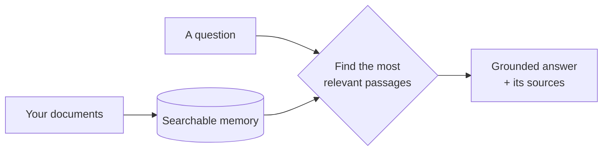

# System at a glance

The 60-second mental model. For the full stack and RAG internals, see [tech-stack.md](./tech-stack.md).

## In one sentence

An assistant that answers questions **only** from documents you give it — and admits when it doesn't know.

## The idea: an open-book exam

Hand the assistant a library of your documents. When someone asks a question, it finds the most relevant passages and writes an answer **from those passages only** — it never improvises from general knowledge. If the answer isn't in the library, it says so. Every answer shows which documents it used.

## How it works — three moves

1. **Teach it** — an admin uploads documents; the system files them into a searchable memory.
2. **Ask it** — anyone asks a question in plain language (any language works).
3. **It answers** — it pulls the most relevant passages, writes a grounded answer, and cites the documents. No relevant passages → *"I don't have that."*

## Why you can trust it

- **Grounded** — answers come from your documents, not the model's imagination.
- **Cited** — every answer points back to its sources.
- **Honest** — *"that's not in the corpus"* beats a confident wrong answer.

## Who touches what

- **Users** — sign in and chat.
- **Admins** — curate the document library and tune how strict the search is.
- **Super-admins** — branding and top-level settings.

## The three moving parts

- A **web app** people chat with.
- A **brain** (the API) that searches your documents and asks an AI model to write the answer.
- A **memory** (the database) that stores the documents and their searchable form.

Everything else — how it searches, which AI models it uses, how it ranks results — is detail. The shape never changes: *your documents in, a grounded answer out.*
