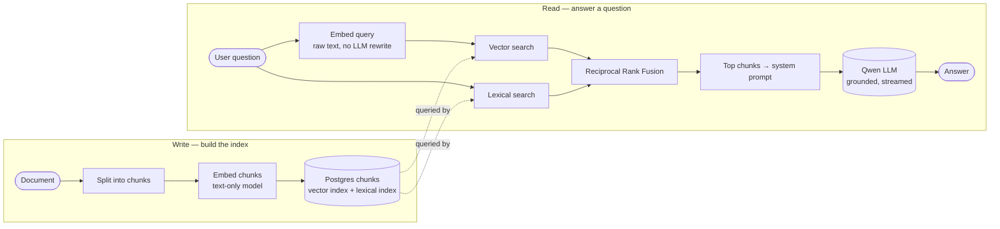

# RAG overview — high-level

The 30-second mental model: how a document becomes searchable, and how a question becomes a grounded answer. Infrastructure details (storage, background tasks, batch sizes, model versions) live in [`ingestion-pipeline.md`](ingestion-pipeline.md) and [`chat-pipeline.md`](chat-pipeline.md) — this doc keeps only what's essential to *RAG*.

## End-to-end picture

## Direct answers

### Is text content saved to the DB in parallel with embedding?
**No.** Parse → embed → INSERT is strictly sequential. The `chunks` rows (text + vector) only appear in the DB after the embedding call returns. The original file bytes are kept separately (for re-download / source links) and are not part of retrieval.

### Is the embedding text-only or multimodal?
**Text-only.** Images inside PDFs are dropped by the parser; only extracted text reaches the embedding model.

### At retrieval — does the LLM rewrite the query, or do we embed the user's raw text?
**Raw text.** No HyDE, no multi-query, no history-aware rewriting. The exact string the user typed is what gets embedded.

### Is there BM25? Rank fusion?
- **Lexical scoring:** Postgres FTS `ts_rank` (tf-idf family, built into Postgres). **Not BM25** — BM25 would require an extension like `pg_search`.
- **Fusion:** **Reciprocal Rank Fusion (RRF).** Picked over weighted-score fusion because vector distance and `ts_rank` scores live on incompatible scales; RRF only uses rank position, so it's robust without per-corpus tuning.

## What we deliberately don't do

| Technique | Why not |
|---|---|
| Reranker (cross-encoder, Cohere Rerank) | Quality lift is marginal on 8 chunks; adds latency. |
| BM25 scoring | Postgres `ts_rank` is good enough and built-in. |
| Query rewriting / HyDE / multi-query | Costs one extra LLM round-trip per chat turn. |
| Chat-history-aware query rewriting | Likely first addition — fixes follow-ups that lose context. |
| Multimodal embeddings | All corpora are text-extractable. |

## Read next

- **[ingestion-pipeline.md](ingestion-pipeline.md)** — write side in detail (storage, background task, failure modes, parser config).
- **[chat-pipeline.md](chat-pipeline.md)** — read side in detail (request lifecycle, latency budget, bottlenecks).
- **[README.md](README.md)** — deployment topology.
