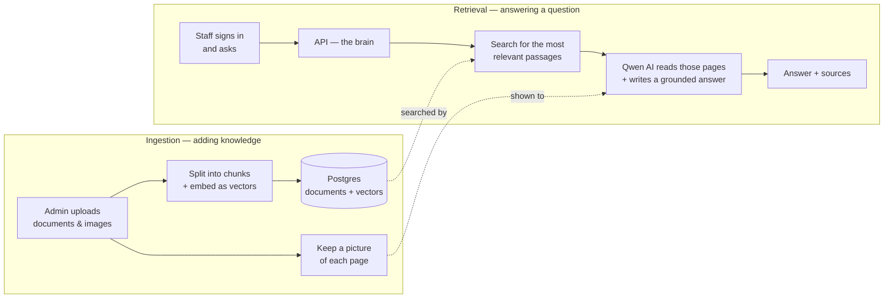

# Tech stack, in brief

The high-level build of the system, kept simple.

## What it is

An internal assistant. Staff sign in and ask questions over a private knowledge base, and it answers **only** from what an admin uploaded — documents, and now images and scans too — with sources, or an honest *"I don't know."*

## What it's built with

| Part | Built with | In plain terms |
|---|---|---|
| **Web app** | React + Vite + TypeScript | what people chat with |
| **API** | FastAPI (Python) | the brain — searches the docs, talks to the AI |
| **Database** | Postgres + pgvector | stores the documents and their searchable form |
| **File storage** | Supabase Storage | keeps the original uploaded files |
| **Sign-in** | Supabase Auth | who you are, and what you're allowed to do |
| **AI** | Qwen (via DashScope) | turns text into searchable vectors, *reads* document pages & images, and writes the answers |

## How it fits together

Two paths share one knowledge base — one fills it, one reads it.

## A question, end to end

1. You sign in and ask.
2. The API finds the most relevant passages in the knowledge base.
3. It hands those passages — and pictures of the pages they came from — to the AI with one rule: answer only from these.
4. The answer streams back with its sources — or *"that's not in the knowledge base."*

## Who's who

- **User** — sign in and chat.
- **Admin** — upload and manage documents; tune how strict the search is.
- **Super-admin** — branding and top-level settings.

That's the whole system at a high level — the detailed mechanics (hybrid search, ranking, relevance tuning) sit underneath this shape.
