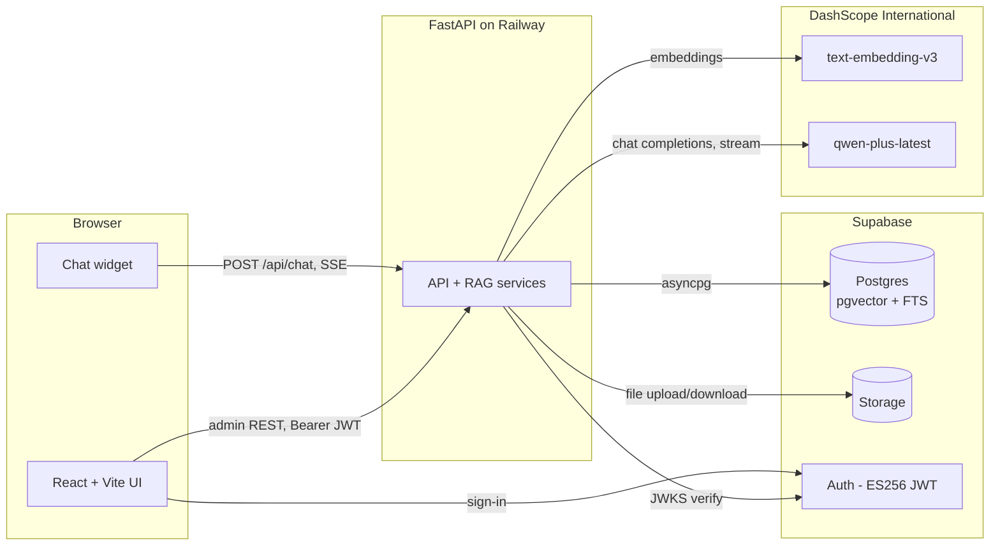
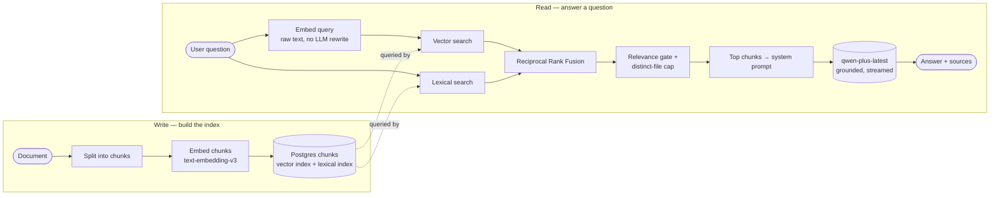

# Tech overview — RAG knowledgebase chatbot

A high-level look at the system: the stack, the RAG pipeline, and how a question becomes a grounded answer.

> Want the 60-second, non-technical version first? See [overview.md](./overview.md).

## What it is

A grounded chatbot that answers only from a corpus an admin curates. It runs in one of two modes — **public** (anonymous visitors, e.g. a marketing landing page) or **internal** (sign-in required) — and signed-in users get saved, per-user chat history. Retrieval is hybrid (semantic + keyword) fused with Reciprocal Rank Fusion, an admin can gate results by a relevance floor, and generation streams from Qwen over Server-Sent Events. If the answer isn't in the corpus, the model is instructed to say so rather than fall back on its general training.

## Stack

| Layer | Technology |
|---|---|
| **Frontend** | React 19 + Vite + TypeScript, Tailwind v4, shadcn/ui, React Router v7, Zustand, React Hook Form + Zod, Axios |
| **Backend** | FastAPI + Uvicorn (Python 3.12), async SQLAlchemy + asyncpg, Pydantic v2, Alembic |
| **Database** | Postgres + pgvector + native Full-Text Search (Supabase) |
| **Storage** | Supabase Storage (original uploaded files) |
| **Auth** | Supabase Auth, ES256 JWT verified via JWKS; role hierarchy `super_admin > admin > user`. Admin APIs require a Bearer token; chat is open in public mode, token-gated in internal mode |
| **AI models** | `qwen-plus-latest` for chat, `text-embedding-v3` (1024-dim) for embeddings, both via DashScope International |
| **Deploy** | Frontend on Vercel, backend on Railway, data layer on Supabase (ap-southeast-1) |

## Architecture

## RAG pipeline

Two sides: a write side that builds the searchable index, and a read side that answers a question against it.

### Ingestion (write side)

An admin uploads a file (PDF, DOCX, PPTX, XLSX, TXT, HTML). We store the original, parse it into chunks of roughly a few paragraphs each (small chunks keep retrieval sharp), embed every chunk with `text-embedding-v3`, and write the text plus its 1024-dim vector into Postgres. Each chunk also gets a lexical index entry for keyword search. Parsing is text-only; images in PDFs are dropped. The whole thing runs as a background job, and each file carries a status (uploaded, ingesting, ingested, failed) so the admin can retry anything that fails.

### Chat (read side)

The visitor's question is embedded as-is (no query rewriting), then run against both indexes. The top chunks go into the system prompt with a grounding instruction, and `qwen-plus-latest` streams the answer back token by token over SSE. The cited documents are surfaced alongside the answer as clickable sources.

## Hybrid retrieval and RRF

Retrieval uses two arms, because each covers the other's blind spot:

- **Vector search** (pgvector, cosine distance) finds semantically similar chunks even when no words match.
- **Lexical search** (Postgres Full-Text Search, `ts_rank`) matches exact terms like names, codes, and numbers. This is tf-idf-family ranking, not BM25.

Each arm returns its own top-ranked list. We merge them with **Reciprocal Rank Fusion**: every list a chunk appears in contributes `1 / (60 + its rank in that list)`, and we add those contributions up. Higher total wins. The constant 60 is the standard RRF default; it damps how much the very top ranks dominate.

A worked example makes it concrete. Say the two arms return these top chunks:

| Chunk | Vector rank | Lexical rank | RRF score | Final |
|---|---|---|---|---|
| B | 2 | 1 | 1/62 + 1/61 = **0.0325** | 1st |
| A | 1 | 3 | 1/61 + 1/63 = **0.0323** | 2nd |
| D | – | 2 | 1/62 = **0.0161** | 3rd |
| C | 3 | – | 1/63 = **0.0159** | 4th |

B wins because it ranks near the top of *both* arms. A is a close second despite topping the vector arm, since it's weaker on keywords. C and D each show up in only one arm, so they land well below the chunks both arms agree on. That agreement-rewarding behavior is the whole point.

We fuse by rank instead of raw score on purpose. Vector cosine distance and `ts_rank` live on completely different scales, so adding the raw numbers would need per-corpus tuning to mean anything. Rank position sidesteps that and stays robust with zero tuning.

### What reaches the prompt — three admin knobs

After fusion and dedupe, three settings shape the final context:

- **Relevance threshold** — an optional floor on each chunk's *cosine similarity* to the question (0–1, default `0` = off). RRF decides the *order*; this gate decides what's *relevant enough* to keep. Cosine similarity is human-readable (≈0.5–0.7 for good hits), unlike the tiny RRF score, so it's the number admins actually calibrate against.
- **Max distinct files** — caps how many separate documents may be cited per answer (default `3`), so a single file can't crowd out the rest.
- **Top-N chunks** — how many ranked chunks feed the prompt (default `8`), bounding the LLM's context budget.

A built-in **Debug Mode** (admin-only) shows both numbers on each source chip — the RRF rank-score *and* the 0–1 cosine similarity — so admins can see exactly what they're tuning.

## What we deliberately leave out

| Technique | Why not, for now |
|---|---|
| Cross-encoder reranker | Marginal quality lift on a handful of chunks, adds latency |
| BM25 | Postgres `ts_rank` is good enough and built in |
| Query rewriting / HyDE / multi-query | Costs an extra LLM round-trip per turn |
| History-aware query rewriting | The most likely next addition; fixes context-losing follow-ups |
| Multimodal embeddings | All corpora are text-extractable today |

These are easy to add later if usage or quality needs justify them. Building them now would mean paying for scale we don't have yet.
