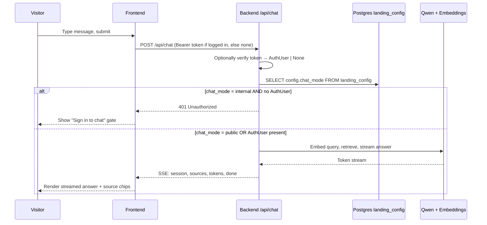

# Phase 01: Data Flow

Five flows cover every meaningful state transition introduced by this phase. Each is one sequence diagram with the failure modes called out — that's where the bugs hide.

---

## Flow 1: Sign-in & role-based redirect

**Trigger:** user submits the login form at `/login`.

```mermaid
sequenceDiagram
    participant U as User
    participant FE as Frontend
    participant SB as Supabase Auth
    participant BE as Backend API

    U->>FE: Submit email + password
    FE->>SB: signInWithPassword(email, password)
    alt credentials valid AND not banned
        SB-->>FE: Session(access_token JWT, user.user_metadata.role)
        FE->>FE: Store session; read role
        alt role == super_admin OR admin
            FE-->>U: Redirect to /admin/knowledge
        else role == user
            FE-->>U: Redirect to /workspace
        else role missing or unknown
            FE->>SB: signOut()
            FE-->>U: Inline error "Account misconfigured"
        end
    else credentials invalid
        SB-->>FE: 400 Invalid grant
        FE-->>U: Inline error "Wrong email or password"
    else account banned (deactivated)
        SB-->>FE: 400 with banned error code
        FE-->>U: Inline error "Account is inactive"
    end
```

**Failure modes:**
- **Role missing in JWT** (admin forgot to set it when creating the user, or seed script bug) → user signed out, inline "Account misconfigured" message. Logged to console for debugging.
- **Network drop mid-sign-in** → standard Supabase retry behavior; FE shows generic "Try again" toast.
- **JWT issued but FE state corrupted** → next API call returns 401; auth store auto-clears; user bounced to `/login`.

---

## Flow 2: User chats (with role gating in both modes)

**Trigger:** any actor submits a message via `POST /api/chat`.



**Failure modes:**
- **landing_config row missing or `chat_mode` key absent** → treat as `public` (default). No error to user.
- **Token expired mid-stream** → BE has already started streaming; SSE finishes the current turn but the next POST returns 401 and FE handles it like a normal sign-in expiry.
- **DB unreachable when reading landing_config** → 503 to FE; widget shows "Chat unavailable" (existing error path).
- **Mode flipped to internal while anonymous user is mid-conversation** — see Flow 4.

---

## Flow 3: Admin creates / deactivates a user

**Trigger:** admin submits the Add user dialog or clicks Deactivate/Reactivate.

```mermaid
sequenceDiagram
    participant A as Admin
    participant FE as Frontend
    participant BE as Backend /api/users
    participant SB as Supabase Auth Admin API

    A->>FE: Fill Add user dialog (email, password, role)
    FE->>BE: POST /api/users  (Bearer: admin's JWT)
    BE->>BE: require_role("admin") — verify caller is admin OR super_admin
    BE->>SB: admin.createUser({email, password, user_metadata: {role}})
    alt email already exists
        SB-->>BE: 409 (User already registered)
        BE-->>FE: 409 with structured error
        FE-->>A: Inline dialog error "This email is already registered"
    else success
        SB-->>BE: 201 + new user object
        BE-->>FE: 201 + {id, email, role}
        FE-->>A: Show post-create confirmation with one-time password copy
    end

    Note over A,SB: Later — Deactivate
    A->>FE: Click Deactivate on a row
    FE->>BE: PATCH /api/users/{id}/deactivate  (Bearer: admin's JWT)
    BE->>BE: require_role("admin")
    BE->>SB: admin.updateUserById(id, {banned_until: far-future})
    SB-->>BE: 200
    BE-->>FE: 200
    FE-->>A: Row status flips to "deactivated"; button label "Reactivate"
```

**Failure modes:**
- **Caller is `user` role attempting POST/PATCH `/api/users`** → 403 immediately, before any Supabase call. Tested by TC-01-008.
- **Supabase Admin API down** → BE returns 502; FE shows "Couldn't create user. Try again."
- **`SUPABASE_SECRET_KEY` missing** → BE startup fails fast (existing config validation). No silent degradation.
- **Self-deactivation attempt** — blocked at the UI (the button isn't rendered). If somehow bypassed by direct API call, the backend should also reject (defense-in-depth: `if caller.id == target.id and target.role == "super_admin": 400`). Add this BE check.

---

## Flow 4: Super-admin flips chat mode

**Trigger:** super-admin changes the radio and clicks Save changes.

```mermaid
sequenceDiagram
    participant S as Super-admin
    participant FE as Frontend
    participant BE as Backend /api/landing-config
    participant PG as Postgres landing_config
    participant V as Anonymous visitor (different session)

    S->>FE: Toggle Internal radio + click Save changes
    FE->>BE: PUT /api/landing-config  (Bearer: super-admin's JWT, body has full config blob)
    BE->>BE: require_role("super_admin")
    BE->>PG: UPDATE landing_config SET config = $1
    PG-->>BE: OK
    BE-->>FE: 200
    FE-->>S: Toast "Saved"; chip updates to "Currently: Internal"

    Note over V,PG: meanwhile, anonymous visitor on /
    V->>FE: Already on landing page, mid-chat
    V->>FE: Types next message, submits
    FE->>BE: POST /api/chat (no Bearer)
    BE->>PG: SELECT config.chat_mode
    PG-->>BE: "internal"
    BE-->>FE: 401
    FE-->>V: Widget replaces with "Sign in to chat" gate; prior history greyed out
```

**Failure modes:**
- **Admin (non-super) calls PUT directly via curl** → 403. Tested by TC-01-009.
- **Save succeeds but the FE doesn't update the chip** (race / stale state) → user reloads page; chip reflects DB truth. Acceptable.
- **Anonymous visitor mid-stream when flip happens** — the in-flight SSE response completes (BE doesn't kill it). The NEXT message attempt fails with 401. Passive-flip behavior per DECISIONS.md.

---

## Flow 5: Admin renames a document

**Trigger:** admin clicks Save name in the Rename dialog.

```mermaid
sequenceDiagram
    participant A as Admin
    participant FE as Frontend
    participant BE as Backend /api/documents
    participant PG as Postgres documents

    A->>FE: Type new filename + Save name
    FE->>BE: PATCH /api/documents/{id}  (Bearer: admin JWT, body {filename: "new name.pdf"})
    BE->>BE: require_role("admin")
    BE->>BE: Validate filename (1–255, trimmed, no path separators)
    alt valid
        BE->>PG: UPDATE documents SET filename = $1 WHERE id = $2
        PG-->>BE: OK
        BE-->>FE: 200 + updated document
        FE-->>A: Close dialog; row reflects new filename
    else invalid
        BE-->>FE: 400 with structured error
        FE-->>A: Inline error in dialog
    end
```

**Failure modes:**
- **Concurrent rename by another admin** → last write wins (no optimistic locking this phase). Acceptable: admin team is small.
- **Document deleted between dialog open and Save** → BE returns 404; FE shows toast "This file no longer exists" and refreshes the list.
- **Filename validation drift between FE and BE** — single source of truth is BE. FE pre-validates for UX but does not block submit on its own opinion alone.
- **Storage object path NOT changed** — by design. Already-stored chunks remain valid. Documented in wireframe notes.
