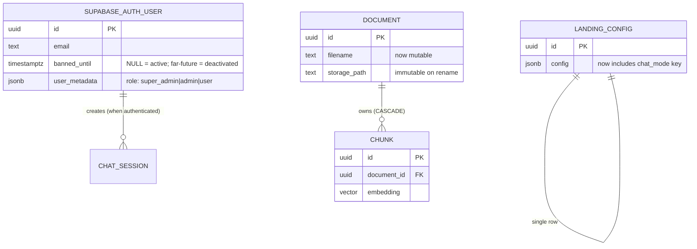

# Phase 01: Data Model

## Summary

This phase **does not add a single new database table.** All role state lives in Supabase Auth's `user_metadata`; the chat-mode toggle lives inside the existing `landing_config.config` JSONB blob; the only Postgres mutation is making `documents.filename` writable. Cascade-delete on documents → chunks is already in place (no schema change). The data model is intentionally minimal so the phase fits the 1–2 week deadline.

## Entities

### User (Supabase Auth-managed)

We don't own this table — Supabase Auth does. We treat it as an external system with a contract on `user_metadata`. The values we read/write:

| Field | Type | Constraints | Notes |
|---|---|---|---|
| `id` | uuid | PK | Supabase-issued |
| `email` | text | unique, lowercased | Supabase-enforced |
| `encrypted_password` | text | — | Supabase-managed |
| `banned_until` | timestamptz \| null | — | **Our "deactivated" flag.** Setting to a far-future date prevents sign-in. `NULL` = active. |
| `user_metadata.role` | enum-as-text | required: one of `super_admin`, `admin`, `user` | **NEW: backend now reads and enforces this.** |
| `created_at` | timestamptz | — | Supabase-managed |

**Why `banned_until` for deactivation:** Supabase Auth already enforces it on token refresh — no custom DB column, no custom check needed on hot paths. "Reactivate" = clear the field. Already-issued JWTs stay valid until expiry (~1h); documented as accepted limitation.

**Why `role` in `user_metadata` (not its own column):** keeps the user identity inside Supabase Auth's purview; backend reads it from the verified JWT claims; matches DECISIONS.md locked choice.

### landing_config (existing — no schema change)

| Field | Type | Constraints | Notes |
|---|---|---|---|
| `id` | uuid | PK | Single-row table; one row only |
| `config` | jsonb | — | Free-form. **New key added:** `chat_mode` |
| `updated_at` | timestamptz | — | Existing |

**New key inside `config` JSONB:**

```json
{
  "chat_mode": "public",  // or "internal"  -- default "public" if absent
  "...existing brand preset keys remain unchanged..."
}
```

No migration; JSONB absorbs new keys for free. Defensive read on the consumer side: `config.get("chat_mode", "public")`.

### documents (existing — schema unchanged, write path extended)

The schema does not change. The only difference is that `filename` becomes writable via a new `PATCH /api/documents/{id}` endpoint. Everything else (storage_path, chunk_count, status, error_message) stays as-is.

| Field | Type | Constraints | Notes |
|---|---|---|---|
| `id` | uuid | PK | Existing |
| `filename` | text | not null, 1–255 chars | **Now mutable** via PATCH |
| `mime_type` | text | nullable | Existing |
| `storage_path` | text | not null, immutable | Existing — NOT changed on rename |
| `status` | enum | — | Existing |
| `chunk_count` | int | — | Existing |
| `error_message` | text | nullable | Existing |
| `uploaded_at` | timestamptz | — | Existing |

### chunks (existing — completely unchanged)

No fields added or modified. Mentioned only to confirm the existing `ON DELETE CASCADE` + ORM cascade still does the vector-cleanup work — no code change required for "deletion removes vectors."

## Relationships



`SUPABASE_AUTH_USER → CHAT_SESSION` is a soft relationship — chat sessions are created anonymously today; once internal mode + login lands, sessions started by an authenticated user *could* be associated with their `user_id` (existing `chat_sessions.user_id` nullable column already supports this). **This phase does not require populating that link.** It's a separate concern for later analytics.

## Indexes & Constraints

- No new indexes. Existing `chunks_embedding_ivfflat`, `chunks_tsv_gin`, `documents_pkey` are sufficient.
- No new uniqueness constraints. Supabase Auth handles email uniqueness.
- No new foreign keys. Existing `chunks.document_id → documents.id ON DELETE CASCADE` already does the right thing for KB delete.

## Migration Notes

- **No DDL migrations.** All schema is already in place.
- **One-time data step:** the existing seed script (`python -m app.scripts.seed_admin`) currently creates `admin@airanext.id` with `user_metadata = {"role": "admin"}`. Extending the script to also create a `super_admin` user and a `user` user is a data change, not a schema change. Idempotent (safe to re-run).
- **Backwards-compatible:** `landing_config.config` without `chat_mode` is read as `"public"`. Existing production deployments don't break.
- **Forward-compatible:** if a future phase needs an app-owned `user_roles` table (e.g. to track who created whom, multi-tenancy), it can be added without disturbing this phase's design.
