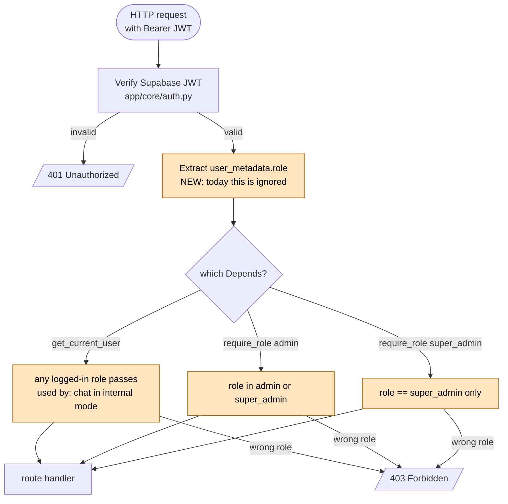

# Phase 01: roles-refactor — Basic Mockup

> Low-fidelity sketch to align on the shape of the phase before writing the spec.
> Iterate here first — fixes are cheap; misunderstandings caught at the wireframe stage save days at the implementation stage.

## What changes (pivot in one sentence)

The chatbot stops being a public marketing widget and becomes an internal customer-service tool: CS reps log in, ask the AI for grounded answers, then relay them to real customers. Admins curate the knowledgebase; a Super-admin owns brand presets and can flip the chat back to public mode.

## Role × permission matrix (the spine of this phase)

```
                                  super_admin   admin     user    anonymous
─────────────────────────────────────────────────────────────────────────────
Chat with AI                          ✓           ✓        ✓     ✓ only if
                                                                  chat_mode
                                                                  = public
Manage knowledge base                 ✓           ✓        ✗        ✗
  ├─ upload                           ✓           ✓        ✗        ✗
  ├─ list                             ✓           ✓        ✗        ✗
  ├─ rename (NEW)                     ✓           ✓        ✗        ✗
  └─ delete (cascades to chunks)      ✓           ✓        ✗        ✗

Manage users (basic CRUD)             ✓           ✓        ✗        ✗
  ├─ list users                       ✓           ✓        ✗        ✗
  ├─ create user                      ✓           ✓        ✗        ✗
  ├─ deactivate user                  ✓           ✓        ✗        ✗
  └─ (NO password reset / invitation email — explicitly out of scope)

Edit brand presets / landing config   ✓           ✗        ✗        ✗
Toggle chat_mode (public ↔ internal)  ✓           ✗        ✗        ✗
```

## Auth dependency split (backend)



> Orange = new code in this phase. **Today the role field is written by the seed script but never read** — that's the pre-existing security hole we close as the first thing in this phase.

## Login → role-based redirect

```mermaid
flowchart LR
    L([/login form]) --> SIGNIN[supabase.auth.signInWithPassword]
    SIGNIN -->|fail| LERR[error toast]
    SIGNIN -->|success| ROLE{session<br/>user_metadata.role}
    ROLE -->|super_admin or admin| ADMIN_LANDING[/admin]
    ROLE -->|user| CHAT_LANDING[/internal-chat]
    ROLE -->|missing/unknown| LERR2[error: account misconfigured]
```

## Screen mockups (ASCII wireframes)

### 1. Admin sidebar — role-aware visibility

```
┌────────────────────────────────────┐
│  Aira Admin           [▼ admin@..] │
├────────────────────────────────────┤
│  📁 Knowledge base                 │   ← admin, super_admin
│  👥 Users                          │   ← admin, super_admin  (NEW)
│  🎨 Landing config                 │   ← super_admin only    (NEW gate)
│  💬 Chat mode  [Internal ▾]        │   ← super_admin only    (NEW)
├────────────────────────────────────┤
│  Sign out                          │
└────────────────────────────────────┘
```

### 2. Knowledge base — add Rename action

```
┌──────────────────────────────────────────────────────────────┐
│  Knowledge base                              [+ Upload file] │
├──────────────────────────────────────────────────────────────┤
│  Filename               Status     Chunks    Actions         │
│  ─────────────────────  ─────────  ──────    ──────────────  │
│  qna-aira-next.pdf      ingested   48        ✏️ 🔄 🗑️        │
│  pricing-2026.pdf       ingesting  —         🔄                │
│  faq-broken.pdf         failed     —         🔄 🗑️             │
└──────────────────────────────────────────────────────────────┘
                              ↑       ↑   ↑   ↑
                                  rename│   delete (already cascades)
                                       reingest (existing)

      ┌─ Rename dialog (NEW) ──────────┐
      │  Rename file                   │
      │  ┌──────────────────────────┐  │
      │  │ qna-aira-next.pdf        │  │
      │  └──────────────────────────┘  │
      │       [Cancel]  [Save name]    │
      └────────────────────────────────┘
```

> Note: rename only changes `documents.filename` (and the SSE source-chip label). Storage object path is *not* renamed because Supabase Storage doesn't support cheap rename; the original `storage_path` stays as `documents/{id}/{original}` so existing chunks remain valid.

### 3. Users page — admin-only basic CRUD

```
┌──────────────────────────────────────────────────────────────┐
│  Users                                        [+ Add user]   │
├──────────────────────────────────────────────────────────────┤
│  Email                  Role          Status      Actions    │
│  ─────────────────────  ───────────   ─────────   ─────────  │
│  superboss@airanext.id  super_admin   active      —          │
│  syahiid@airanext.id    admin         active      [Deactivate]│
│  cs.dewi@airanext.id    user          active      [Deactivate]│
│  cs.budi@airanext.id    user          deactivated [Reactivate]│
└──────────────────────────────────────────────────────────────┘
                                                       ↑
                                          (super_admin cannot deactivate self;
                                           super_admin row hides the button entirely)

      ┌─ Add user dialog (NEW) ──────────┐
      │  Add user                        │
      │  Email     [______________]      │
      │  Password  [______________] (8+) │
      │  Role      ( ) user              │
      │            ( ) admin             │
      │            ( ) super_admin       │
      │       [Cancel]   [Create]        │
      └──────────────────────────────────┘
```

> No email invitation, no password reset (explicitly out of scope). Admin types the initial password and hands it to the user out-of-band. User can change it themselves via Supabase's password update API in a future phase.

### 4. Chat mode toggle (super_admin only)

```
┌──────────────────────────────────────────────────────────────┐
│  Chat mode                                                   │
│                                                              │
│   Who can chat with Aira on the landing page?                │
│                                                              │
│   ( ) Public        — anyone visiting the page can chat     │
│   (●) Internal only — visitors must log in first            │
│                                                              │
│  When set to Internal, the landing widget shows a            │
│  "Please sign in" prompt instead of the chat form.           │
│                                                              │
│                                              [Save]          │
└──────────────────────────────────────────────────────────────┘
```

### 5. Landing page chat widget — gated by chat_mode

```
chat_mode = public                     chat_mode = internal (visitor not logged in)

  ┌─ Chat with Aira ──────┐              ┌─ Chat with Aira ──────┐
  │                       │              │                       │
  │  Hi! I'm Aira...      │              │  🔒 Internal use only │
  │                       │              │                       │
  │  [Ask anything...]    │              │  Sign in to chat.     │
  │                       │              │                       │
  └───────────────────────┘              │       [Sign in]       │
                                         └───────────────────────┘
```

## Seed script — extend to all 3 roles

Today: `python -m app.scripts.seed_admin` creates one user `admin@airanext.id` with `role=admin`.

After this phase: same command, but creates three users (idempotent):

```
super.boss@airanext.id   /  <env: SEED_SUPER_PASSWORD>     role=super_admin
admin@airanext.id        /  <env: SEED_ADMIN_PASSWORD>     role=admin
cs.demo@airanext.id      /  <env: SEED_USER_PASSWORD>      role=user
```

> Passwords read from env vars (no hardcoded secrets after this phase). Fallback to existing hardcoded `Qwenragadmin123!` only if env vars unset, for dev convenience.

## What does NOT change

- **Cascade delete** — already works (ORM cascade + `ON DELETE CASCADE` on `chunks.document_id`). No code to write.
- **Chunk-level vector cleanup** — implied by cascade delete, already working.
- **Supabase Auth as credential layer** — keeps the existing ES256 JWKS verification path.
- **`landing_config.config`'s schemaless JSONB shape** — add `chat_mode` as one more key; no migration.

## Open questions (kept narrow on purpose)

1. **Seed script invocation** — Boss mentioned "npm run seed" but the script is Python and lives in the backend. Confirm we keep `python -m app.scripts.seed_admin` (just update what it seeds), OR wire a thin `npm run seed` proxy in the FE repo that shells out to the backend's script. The former is simpler.
2. **What happens to in-flight anonymous chat sessions when super_admin flips chat_mode = internal?** Options: (a) let them finish the current turn, then block new requests; (b) immediately block; (c) ignore — no anonymous sessions are persistent anyway because each turn starts fresh. **Recommended: (c)** — simplest, no session-management code, and a refresh naturally lands them on the "Sign in to chat" screen.
3. **Can `super_admin` deactivate themselves?** Recommended: **No** — UI hides the button on the super_admin's own row to prevent self-lockout. If they need to, another super_admin must do it.
