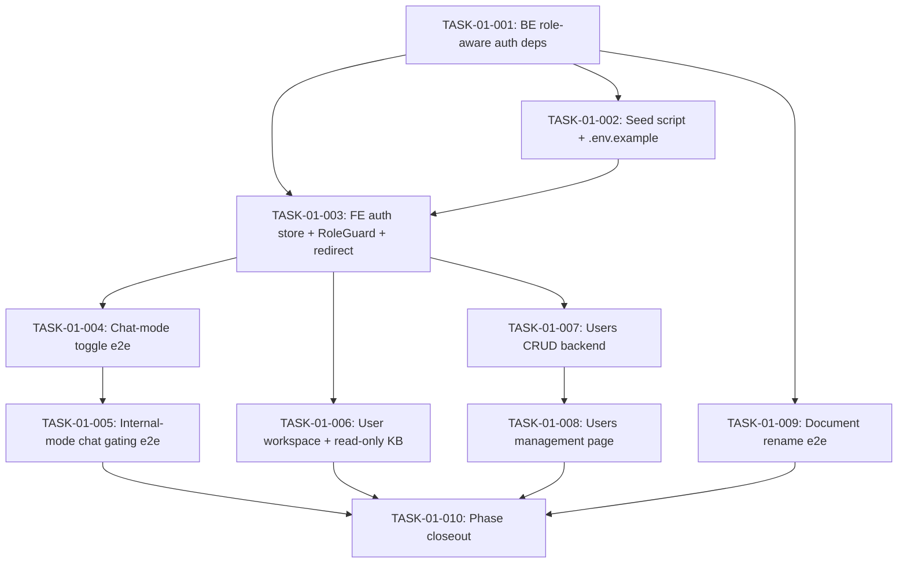

# Phase 01 — Tasks

10 tasks decomposing the roles-refactor phase. Vertical slicing where the work crosses BE+FE (M2 / M3 / M4); horizontal in M1 because it's pure infrastructure. Sized 0.5–2 days each, no XL.

## Recommended order

## Tasks by milestone

### Milestone 1 — Close security hole + role infrastructure
- [x] [TASK-01-001](./TASK-01-001.md) — Backend role-aware auth dependencies (S)
- [x] [TASK-01-002](./TASK-01-002.md) — Seed script for 3 roles + env vars (XS)
- [x] [TASK-01-003](./TASK-01-003.md) — Frontend role-aware auth store + RoleGuard + login redirect (M)

### Milestone 2 — User chat (client's primary ask)
- [ ] [TASK-01-004](./TASK-01-004.md) — Chat-mode toggle end-to-end (M)
- [ ] [TASK-01-005](./TASK-01-005.md) — Internal-mode chat gating end-to-end (M)
- [ ] [TASK-01-006](./TASK-01-006.md) — User workspace + read-only KB access (M)

### Milestone 3 — Admin user management
- [ ] [TASK-01-007](./TASK-01-007.md) — Users CRUD backend (M)
- [ ] [TASK-01-008](./TASK-01-008.md) — Users management page (M)

### Milestone 4 — Knowledge base rename + closeout
- [ ] [TASK-01-009](./TASK-01-009.md) — Document rename end-to-end (S)
- [ ] [TASK-01-010](./TASK-01-010.md) — Phase closeout: docs + full TC sweep (S)

## Status summary

- **Total:** 10 tasks
- **Estimated:** ~9 days (3 S + 1 XS + 6 M) + 1–2 day buffer = matches ROADMAP's 10-day budget
- **Critical path:** 001 → 003 → 004 → 005 → 010 (5 tasks; M2 sequential because single implementer + shared role infra)
- **Parallelizable if a second pair of hands joins:** 002 can land after 001 in parallel with 003 start; 009 needs only 001 and can run any time after; 007+008 can run in parallel to 004+005+006.

## Test-case coverage map

Every test case in `../test-cases/` is mapped to at least one task. The implementer runs `/qa-manual-test-run` against the markdown TC files at the end of each milestone (Step 10 closeout sweeps all 12).

| Test case | Title | Satisfied by |
|---|---|---|
| TC-01-001 | All 3 roles can sign in | 002, 003 |
| TC-01-002 | User signs in and chats | 006 |
| TC-01-003 | Admin renames a document | 009 |
| TC-01-004 | Admin deletes a doc; chunks removed | 010 (regression — no code change) |
| TC-01-005 | Admin creates a user | 007, 008 |
| TC-01-006 | Super-admin toggles chat mode | 004, 005 |
| TC-01-007 | Deactivated user can't sign in | 007, 008 |
| TC-01-008 | User can't reach admin endpoints | 001 |
| TC-01-009 | Admin can't reach super-admin landing | 004 |
| TC-01-010 | Super-admin can't deactivate self | 007, 008 |
| TC-01-011 | Public chat continues to work (regression) | 005 |
| TC-01-012 | KB upload continues to work (regression) | 010 (no code change) |

## How to pick up a task

1. Open the task's `TASK-01-NNN.md`.
2. Read the **Goal**, **Acceptance Criteria**, and **Implementation Notes**.
3. Check **Dependencies** — make sure blockers are `done`.
4. Run `/feature-dev` with the task description, or implement directly.
5. After implementation, run the relevant TC files (`../test-cases/TC-01-NNN.md`) via `/qa-manual-test-run` — they're executed manually by the `qa-manual-tester` sub-agent via Playwright MCP, never as test-runner scripts.
6. When the task's acceptance criteria are met and its mapped TCs pass, flip the task's Status to `done` and the checkbox above.
